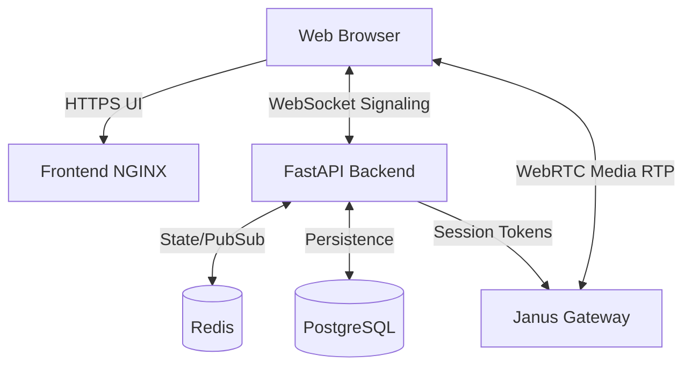

# Vedameet

A production-grade, self-hosted Zoom-clone system using modern open-source stacks.

## Core Services Context
1. **Frontend:** React + Vite + Tailwind CSS + shadcn/ui.
2. **Backend:** FastAPI, providing JWT authentication and managing Meeting data and Signaling by utilizing WebSockets synced across instances with Redis.
3. **Media Engine:** Janus WebRTC Gateway (SFU architecture) processing the WebRTC streams separately.
4. **Database:** Postgres + SQLAlchemy.

## Architecture
WebSockets manage real-time text chat, meeting joins/leaves, and mute coordination. Janus handles the high-bandwidth WebRTC video routing in SFU mode (Selective Forwarding Unit) to keep CPU low on the FastAPI servers.



## Running the Application

### 1. Requirements
Ensure you have Docker and `docker-compose` installed.

### 2. Configure Environment
Copy the example variables:
```bash
cp backend/.env.example backend/.env
cp frontend/.env.example frontend/.env
```

### 3. Start Services
Run the full stack:
```bash
docker-compose up --build
```

### 4. Access UI
- Frontend: `http://localhost:5173`
- Backend API Docs: `http://localhost:8000/docs`
- Janus API: `http://localhost:8088/janus`
