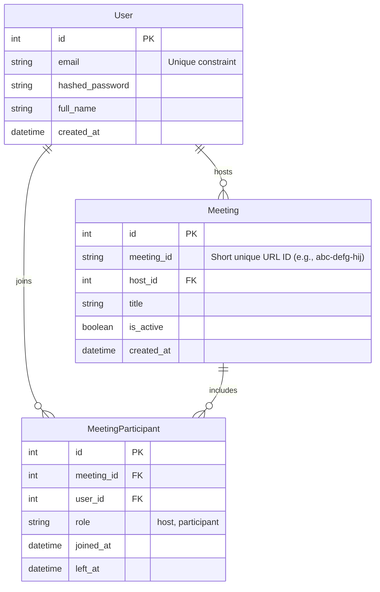

# Vedameet Architecture Plan

## 1. Database Schema
The schema isolates user accounts, meeting sessions, and participant history.

## 2. Signaling & Media Flow
We separate signaling (FastAPI via WebSockets) from media streams (Janus via WebRTC). Redis manages cross-instance WebSocket communications.

```mermaid
sequenceDiagram
    participant Client
    participant FastAPI as FastAPI (WebSocket)
    participant Redis as Redis (Pub/Sub)
    participant Janus as Janus (SFU Plugin)

    Client->>FastAPI: Connect WS (Pass JWT token)
    FastAPI->>Client: Connection Accepted
    Client->>FastAPI: Join Room (meeting_id)
    FastAPI->>Redis: Subscribe to room's pub/sub channel
    FastAPI-->>Client: Joined (Participant List + State)
    
    rect rgb(30, 30, 45)
    note right of Client: Media Setup Phase
    Client->>FastAPI: Request Janus Token / Info
    FastAPI->>Janus: Admin API: Create Session, Handle Auth
    Janus-->>FastAPI: Session ID + Token
    FastAPI-->>Client: Janus Session Info
    Client->>Janus: Setup RTCPeerConnection (VideoRoom Plugin)
    Janus-->>Client: Publish Stream (Offer/Answer exchanged)
    end
    
    rect rgb(30, 45, 30)
    note right of Client: In-Meeting Operations
    Client->>FastAPI: Send Chat Message / Action
    FastAPI->>Redis: Publish Message to channel
    Redis->>FastAPI: Receive Message (for all subscribers)
    FastAPI->>Client: Broadcast Chat/Action
    end
```

## 3. Core API Endpoints

### Authentication & Routing
- `POST /api/auth/register` - Create user
- `POST /api/auth/login` - Obtain JWT tokens
- `POST /api/auth/refresh` - Refresh access token

### Meetings
- `POST /api/meetings/` - Generate new meeting ID & entry
- `GET /api/meetings/{id}` - Fetch meeting metadata
- `PUT /api/meetings/{id}/end` - Host end meeting (terminates WS rooms)

### WebSockets (Signaling)
- `WS /ws/meetings/{id}?token=<jwt>` - Main bi-directional channel for chat, joined/left events, remote mute signals, and hand raises.

## 4. Next Steps
Once you approve this architecture and the initial skeleton provided, I will move to Phase 2 and begin setting up the core FastAPI server and core services.
